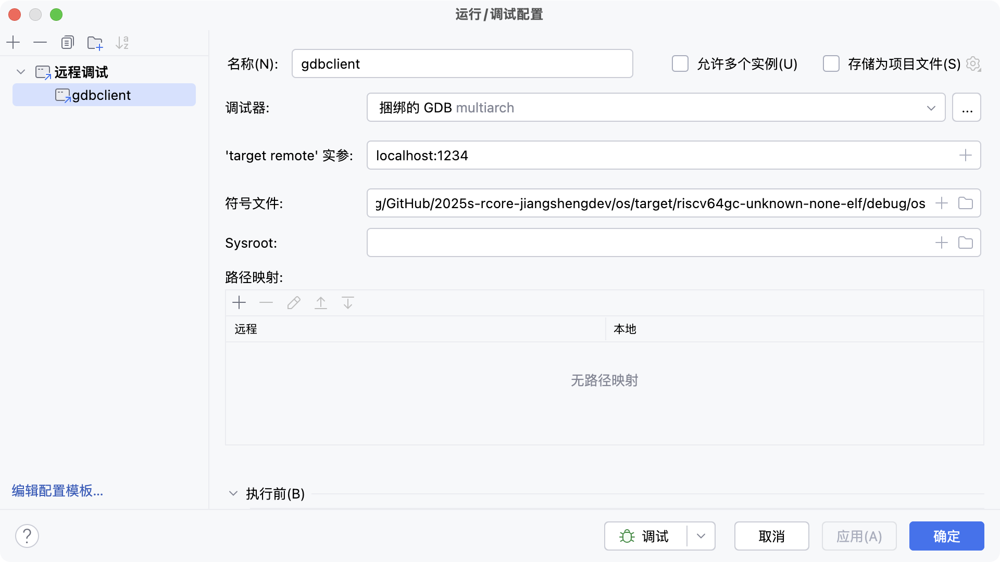
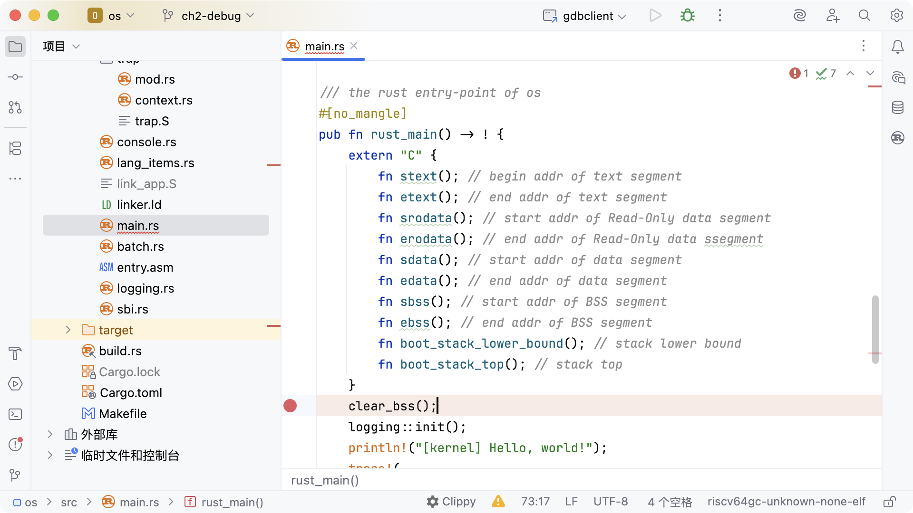
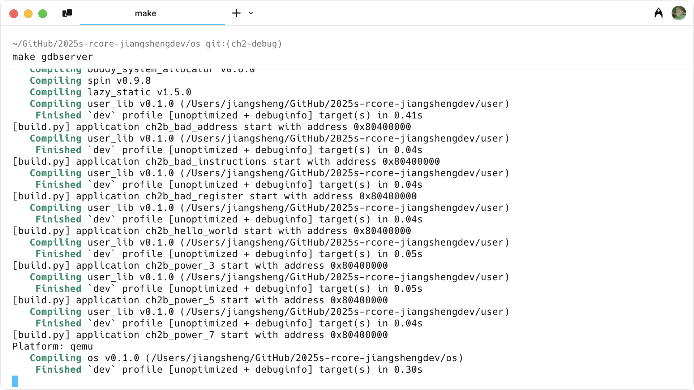
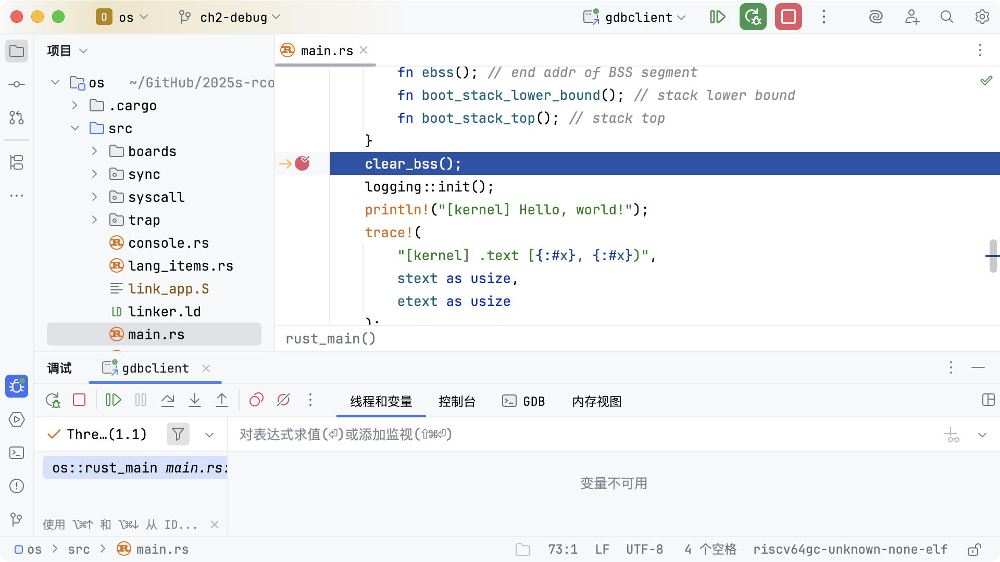

# 代码调试

以 ch2 为例来进行调试

## 代码修改

首先需要对代码进行一些配置的修改

### 用户项目修改

修改 `user/src/linker.ld` 文件，链接时需要保留 debug 信息

```diff
 src/linker.ld | 1 -

@@ -28,6 +28,5 @@ SECTIONS
     }
     /DISCARD/ : {
         *(.eh_frame)
-        *(.debug*)
     }
 }
```

修改 `user/build.py` 文件，配置默认 debug 模式

```diff
 build.py      | 2 +-

@@ -8,7 +8,7 @@ app_id = 0
 apps = os.listdir("build/app")
 apps.sort()
 chapter = os.getenv("CHAPTER")
-mode = os.getenv("MODE", default = "release")
+mode = os.getenv("MODE", default = "debug")
 if mode == "release" :
 	mode_arg = "--release"
 else :
```

修改 `user/Makefile` 文件，配置默认 debug 模式

```diff
 Makefile      | 2 +-

@@ -1,5 +1,5 @@
 TARGET := riscv64gc-unknown-none-elf
-MODE := release
+MODE := debug
 APP_DIR := src/bin
 TARGET_DIR := target/$(TARGET)/$(MODE)
 BUILD_DIR := build
```

修改的提交细节可以查看：

> https://github.com/jiangshengdev/rCore-Tutorial-Test-2025S/commit/247d9c295f0b93e97ccca073bef226bc86b32b76

### 系统项目修改

修改 `os/Makefile` 文件，配置默认 debug 模式

```diff
 os/Makefile | 2 +-

@@ -1,6 +1,6 @@
 # Building
 TARGET := riscv64gc-unknown-none-elf
-MODE := release
+MODE := debug
 KERNEL_ELF := target/$(TARGET)/$(MODE)/os
 KERNEL_BIN := $(KERNEL_ELF).bin
 DISASM_TMP := target/$(TARGET)/$(MODE)/asm
```

修改的提交细节可以查看：

> https://github.com/LearningOS/2025s-rcore-jiangshengdev/commit/0b72ba0cf8f6679f893c4b32bebd084186ca835a

### 生成可执行文件

修改完成后，需要执行

```shell
make build
```

以生成带有调试信息的可执行文件

## 运行/调试配置

点击菜单中的 `运行 -> 编辑配置...`，打开 `运行/调试配置` 弹窗


然后点击左上角的加号，在 `添加新配置` 菜单中选择 `远程调试`

填入如下参数：

- 名称：`gdbclient`

- 'target remote' 实参：`localhost:1234`

- 符号文件：`<你的实验项目目录>/os/target/riscv64gc-unknown-none-elf/debug/os`



## 添加断点

在 `os/src/main.rs` 文件的 `rust_main` 函数中添加行断点



## 启动 QEMU

在项目 os 目录下执行 QEMU 服务器端：

```shell
cd os
make gdbserver
```



## 启动调试

点击菜单中的 `运行 -> 调试...`，然后在弹出的菜单中选择刚刚配置的 `gdbclient` 远程调试项目



即可在断点处暂停，至此可以进行 os 程序的调试。
