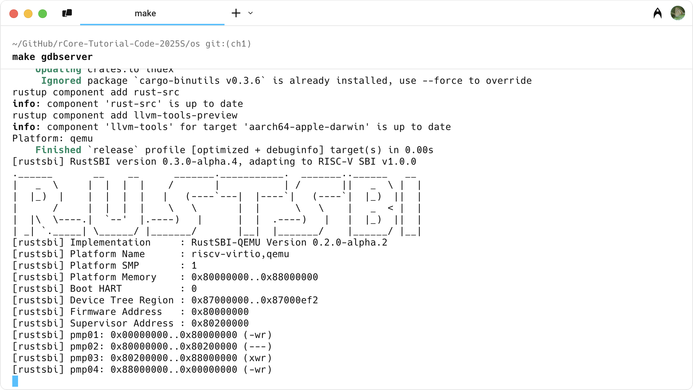

# 实验环境配置

与 rCore-Tutorial-Guide-2025S 文档中的 **第零章：实验环境配置** 重复部分不单独列出。

> https://learningos.cn/rCore-Tutorial-Guide-2025S/0setup-devel-env.html

## OS 环境配置

介绍 macOS 下的环境配置方案。

:::note

请确保使用 Apple M1 或 M2 等芯片。

请确保使用 macOS Sequoia 15.4.1 版本系统。

:::

## Rust 开发环境配置

看 Rust 马上开始。

> https://www.rust-lang.org/zh-CN/learn/get-started

## QEMU 模拟器安装

我们需要使用 QEMU 7.0.0 版本进行实验，为此，从源码手动编译安装 QEMU 模拟器。

:::warning

不要下载 7.2.17 版本。

:::

看 Building QEMU for macOS。

> https://wiki.qemu.org/Hosts/Mac#Building_QEMU_for_macOS

下载 QEMU。

> https://download.qemu.org/qemu-7.0.0.tar.xz

解压到下载文件夹。

```shell
# 安装编译所需的依赖包
brew install ninja
brew install pkgconf
brew install glib
brew install meson
brew install pixman

# 编译安装并配置 RISC-V 支持
cd qemu-7.0.0
./configure --target-list=riscv64-softmmu
make -j$(sysctl -n hw.ncpu)
```

:::tip

QEMU 7.0.0 在不同系统下生成的可执行文件名可能不同。请在 build 目录下用 `ls` 命令确认实际生成的文件名。如果没有
`qemu-system-riscv64-unsigned`，请根据实际文件名进行重命名或软链接操作。

:::

```shell
# 复制并重命名（如有必要）
cd build
cp qemu-system-riscv64-unsigned qemu-system-riscv64
```

编辑 `~/.zshrc` 文件（如果使用的是默认的 zsh 终端），在文件的末尾加入几行：

```shell
# 注意 $HOME 是 macOS 自动设置的，表示你家目录的环境变量，你也可以根据实际位置灵活调整。
export PATH="$HOME/Downloads/qemu-7.0.0/build/:$PATH"
```

如果你将 QEMU 安装在其他目录，请相应修改路径。

重启一个新的终端，或执行 `source ~/.zshrc` 使配置立即生效。

确认 QEMU 的版本：

```shell
qemu-system-riscv64 --version
```

## 试运行 rCore-Tutorial

看 rCore-Tutorial-Guide-2025S 文档。

> https://learningos.cn/rCore-Tutorial-Guide-2025S/0setup-devel-env.html#rcore-tutorial

如果你的环境配置正确，你应当会看到如下输出：

```
[rustsbi] RustSBI version 0.3.0-alpha.4, adapting to RISC-V SBI v1.0.0
.______       __    __      _______.___________.  _______..______   __
|   _  \     |  |  |  |    /       |           | /       ||   _  \ |  |
|  |_)  |    |  |  |  |   |   (----`---|  |----`|   (----`|  |_)  ||  |
|      /     |  |  |  |    \   \       |  |      \   \    |   _  < |  |
|  |\  \----.|  `--'  |.----)   |      |  |  .----)   |   |  |_)  ||  |
| _| `._____| \______/ |_______/       |__|  |_______/    |______/ |__|
[rustsbi] Implementation     : RustSBI-QEMU Version 0.2.0-alpha.2
[rustsbi] Platform Name      : riscv-virtio,qemu
[rustsbi] Platform SMP       : 1
[rustsbi] Platform Memory    : 0x80000000..0x88000000
[rustsbi] Boot HART          : 0
[rustsbi] Device Tree Region : 0x87000000..0x87000ef2
[rustsbi] Firmware Address   : 0x80000000
[rustsbi] Supervisor Address : 0x80200000
[rustsbi] pmp01: 0x00000000..0x80000000 (-wr)
[rustsbi] pmp02: 0x80000000..0x80200000 (---)
[rustsbi] pmp03: 0x80200000..0x88000000 (xwr)
[rustsbi] pmp04: 0x88000000..0x00000000 (-wr)
[kernel] Hello, world!
[DEBUG] [kernel] .rodata [0x80202000, 0x80203000)
[ INFO] [kernel] .data [0x80203000, 0x80204000)
[ WARN] [kernel] boot_stack top=bottom=0x80214000, lower_bound=0x80204000
[ERROR] [kernel] .bss [0x80214000, 0x80215000)
```

恭喜你完成了实验环境的配置，可以开始 **GDB 调试支持** 部分了！

## GDB 调试支持\*

:::tip

使用 GDB debug 并不是必须的，你可以暂时跳过本小节。

:::

你可以选择使用 Homebrew 进行安装。

```shell
brew install riscv64-elf-gdb
```

```shell
# 复制并重命名
cd /opt/homebrew/bin/
cp riscv64-elf-gdb riscv64-unknown-elf-gdb
```

编辑 `~/.zshrc` 文件（如果使用的是默认的 zsh 终端），在文件的末尾加入几行：

```shell
export PATH="/opt/homebrew/bin/:$PATH"
```

重启一个新的终端，或执行 `source ~/.zshrc` 使配置立即生效。

确认 GDB 的版本以及信息：

```shell
riscv64-unknown-elf-gdb
```

```
GNU gdb (GDB) 16.2
Copyright (C) 2024 Free Software Foundation, Inc.
License GPLv3+: GNU GPL version 3 or later <http://gnu.org/licenses/gpl.html>
This is free software: you are free to change and redistribute it.
There is NO WARRANTY, to the extent permitted by law.
Type "show copying" and "show warranty" for details.
This GDB was configured as "--host=aarch64-apple-darwin24.2.0 --target=riscv64-elf".
Type "show configuration" for configuration details.
For bug reporting instructions, please see:
<https://www.gnu.org/software/gdb/bugs/>.
Find the GDB manual and other documentation resources online at:
    <http://www.gnu.org/software/gdb/documentation/>.

For help, type "help".
Type "apropos word" to search for commands related to "word".
>>> quit
```

可以按下 `control + D`（即 `⌃ D`）来退出 GDB。

## 安装 GDB dashboard\*\*

:::tip

使用 GDB dashboard 并不是必须的，你可以暂时跳过本小节。

:::

```shell
brew install wget
wget -P ~ https://github.com/cyrus-and/gdb-dashboard/raw/master/.gdbinit
```

```shell
cd ~/GitHub/rCore-Tutorial-Code-2025S/os
make gdbserver
```



通常 rCore 会自动关闭 QEMU。如果需要强制结束 QEMU，可以先按下 `control + A`（即 `⌃ A`），再按下 `X`。

```shell
cd ~/GitHub/rCore-Tutorial-Code-2025S/os
make gdbclient
```


可以按下 `control + D`（即 `⌃ D`）两次来退出 GDB。

第一次按下会提示 `Quit anyway?`，再次按下来确认退出。
