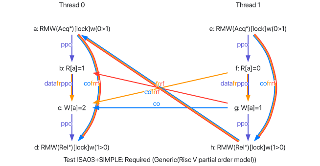

# 内存顺序

import CodeBlock from '@theme/CodeBlock';
import ISA03_SIMPLE from '!!raw-loader!./_assets/litmus/ISA03+SIMPLE.litmus';
import ISA03_SIMPLE_BIS from '!!raw-loader!./_assets/litmus/ISA03+SIMPLE+BIS.litmus';

## Spinlock, Adapt, Test Mutual Exclusion

`ISA03+SIMPLE.litmus`

<CodeBlock language="riscv">{ISA03_SIMPLE}</CodeBlock>

```
Test ISA03+SIMPLE Required
States 1
[a]=2;
Ok
Witnesses
Positive: 2 Negative: 0
Condition forall ([a]=2)
Observation ISA03+SIMPLE Always 2 0
Time ISA03+SIMPLE 0.20
Hash=277646d28ce797552d4c6351515fb0f7
```




## Spinlock, Adapt, Test Mutual Exclusion, With Relaxed Swaps

`ISA03+SIMPLE+BIS.litmus`

<CodeBlock language="riscv">{ISA03_SIMPLE_BIS}</CodeBlock>

```
Test ISA03+SIMPLE+BIS Allowed
States 2
[a]=1;
[a]=2;
Ok
Witnesses
Positive: 4 Negative: 4
Condition exists (not ([a]=2))
Observation ISA03+SIMPLE+BIS Sometimes 4 4
Time ISA03+SIMPLE+BIS 0.20
Hash=01bf4938d5b4cdab1bd650dfc7a4fdf4
```


